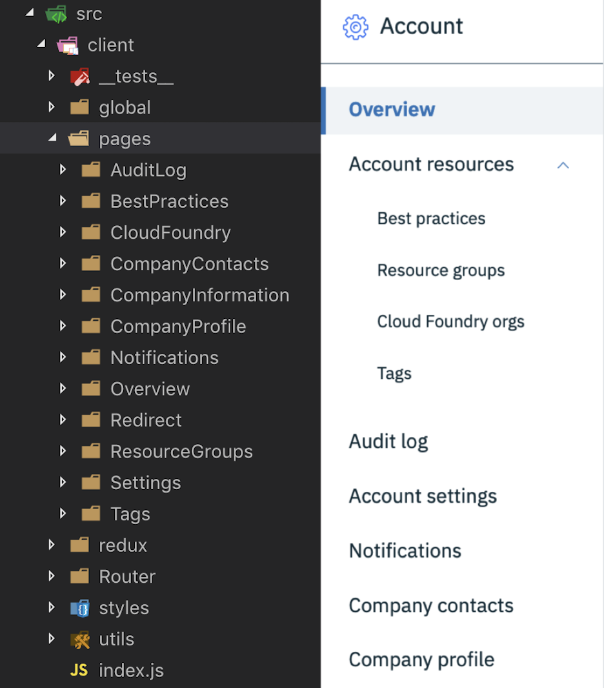
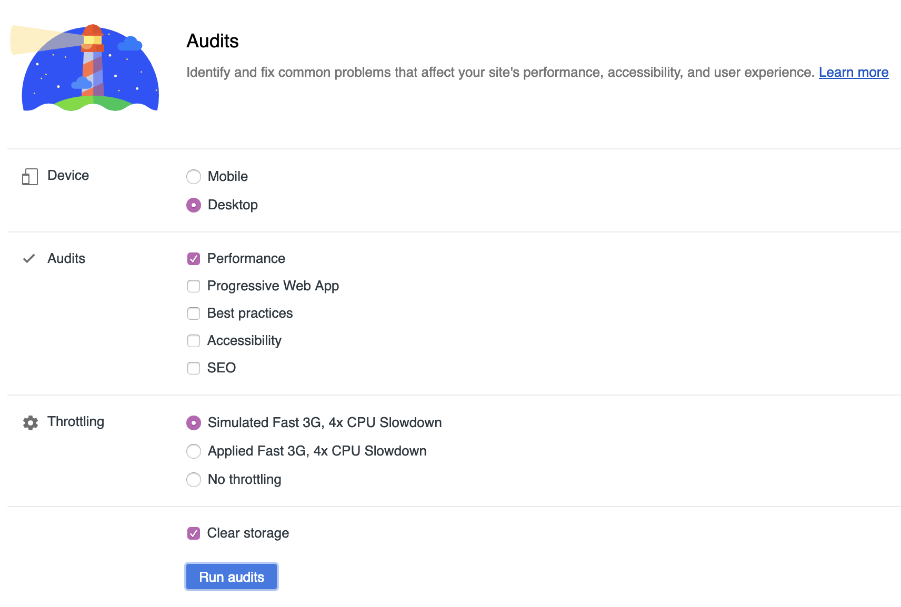
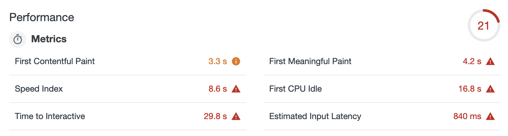
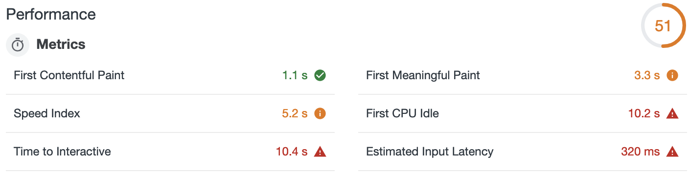

import { Head, Appear, Image } from 'mdx-deck';
import { Split } from 'mdx-deck/layouts';
import { CodeSurfer } from 'mdx-deck-code-surfer';
import vsDark from "prism-react-renderer/themes/vsDark"

import { Default, Invert } from './layouts';
export { default as theme } from './theme';

<Head>
  <title>Post-PUP Performance Playback</title>
</Head>

export default Invert

# Post-PUP Performance Playback

<Appear>
  Or, the unexpected virtue of burning everything down and starting over
</Appear>

---

export default Default

# What's a PUP?

<Appear>
  <p>"Platform Unification Project"</p>
  <p>Consolidating two disparate UIs: Bluemix and SoftLayer</p>
</Appear>

```notes
Bluemix, being IBM's Platform as a Service

And SoftLayer, being IBM's Infrastructure as a Service

Being sent to a different portal for Infrastructure

Different concept of users, billing, account management, etc.
```

---

export default Default

# What did this mean for my team?

<Appear>
  <p>Three new µ-services 😱</p>
  <p>Account</p>
  <p>Billing</p>
  <p>User</p>
</Appear>

```notes
Account: organizing your individual account hierarchy
  - Resource groups
  - CF orgs and spaces
  - Tags

Billing: anything to do with money
  - Usage
  - Payments
  - Invoices

User: a place just for you
  - Profile
  - Login
  - Notifications
```

---

export default Default

# Old Account

<Appear>
  <p>The junk drawer of Bluemix</p>
  <p>Lots of code smell</p>
  <p>Bad developer experience</p>
  <p>Sloooooooooooooooooow</p>
</Appear>

```notes
An amalgamation of the those three services, just for Bluemix

Three years of decisions made in haste, lack of seperation of concerns

Constant slow rebuilds, hard to setup
```

---

export default Invert

# Fixing the Developer Experience

---

export default Default

# Hot Module Replacement

Hot Module Replacement (HMR) exchanges, adds, or removes modules while an application is running, without a full reload.

<Appear>
  <p>Retain application state</p>
  <p>Visual changes are instant</p>
  <p>Quick iteration</p>
</Appear>

```notes
Getting it to work was a bit of a challenge, webpack-dev/hot-middleware

Worth the time investment

- New
  - User profile
  - Login settings
- Rewrites
  - Resource groups
  - Spending notifications
  - Usage dashboard
- Ports
  - Cloud Foundry
  - Subscriptions
  - Account settings
```

---

export default Invert

# Death of a Spinner

---


```notes
Big push to eliminate spinners
```

---

<Image src="./images/ibm-cloud-account-load.gif" />

```notes
Unintentional performance boon from design

First page to greet you

Makes app _seem_ really fast without any work
```

---

<Image src="./images/overview.png" />

```notes
Design came to reflect our codebase
```

---

export default Split

;

# Developer sandbox

<Appear>
  <p>Each entry in the left nav gets it's own directory</p>
  <p>Each directory contains a self-contained React app</p>
  <p>A "Global" directory for the top-level parts of the application</p> 
</Appear>

```notes
top level being: headers, leftnav, unauthorized/gated views, as well as setting user state
```

---

export default Default

# Route-Based Code Splitting

```notes
Because of our directory structure, we were able to pretty easily set up route-based code splitting.
```

---

<CodeSurfer
  title="React Loadable w/ React Router"
  code={require("!raw-loader!./snippets/react-loadable.js")}
  lang="jsx"
  theme={vsDark}
  steps={[
    { notes: ""},
    { range: [2, 3], notes: "We import our HOC, and a loading component"},
    { range: [6, 9], notes: "Next, we create our Loadable"},
    { lines: [7], notes: "Because we're using webpack, this splits automatically" },
    { range: [14, 16], notes: "Now, we just add it to our router" },
  ]}
/>

```notes


React.lazy and React.Suspense are starting to get flushed-out, and you might look into those
```

---

<CodeSurfer
  title="Preloading"
  code={require("!raw-loader!./snippets/preload.js")}
  lang="jsx"
  theme={vsDark}
  steps={[
    { notes: ""},
    { range: [15, 19]},
    { range: [16, 18]},
    { lines: [16]}
  ]}
/>

```notes
Even if the user doesn't click on it right then, we get a head start

Also on the big cards on the overview page
```

---

export default Default

# Preloading Dynamic Data with GraphQL

```notes
Because we weren't rendering dynamic data initially, this allowed us to preload some critical GraphQL queries
```

---

<CodeSurfer
  title="Preloading Queries"
  code={require("!raw-loader!./snippets/query-preload.js")}
  lang="jsx"
  theme={vsDark}
  steps={[
    { notes: ""},
    { range: [5, 15], notes: "Normally, kept with the relevant app"},
    { lines: [25]},
    { range: [17, 23]},
  ]}
/>

---

<Image src="./images/preloaded-query.gif" />

```notes
Avoid overdoing it

Use analytics to determine where they'll be most effective
```

---

export default Invert

# The Results

---

export default Split

# Lighthouse audit



---

Bluemix - _console.bluemix.net/account_


IBM Cloud - _cloud.ibm.com/account_


---

export default Invert

# Moving Forward

---

export default Default

# Things we can improve

<Appear>
  <p>Tree shaking</p>
  <p>Service workers / asset precaching</p>
  <p>Improve DevX more</p>
</Appear>

---

export default Invert

# Thanks!

(Questions?)